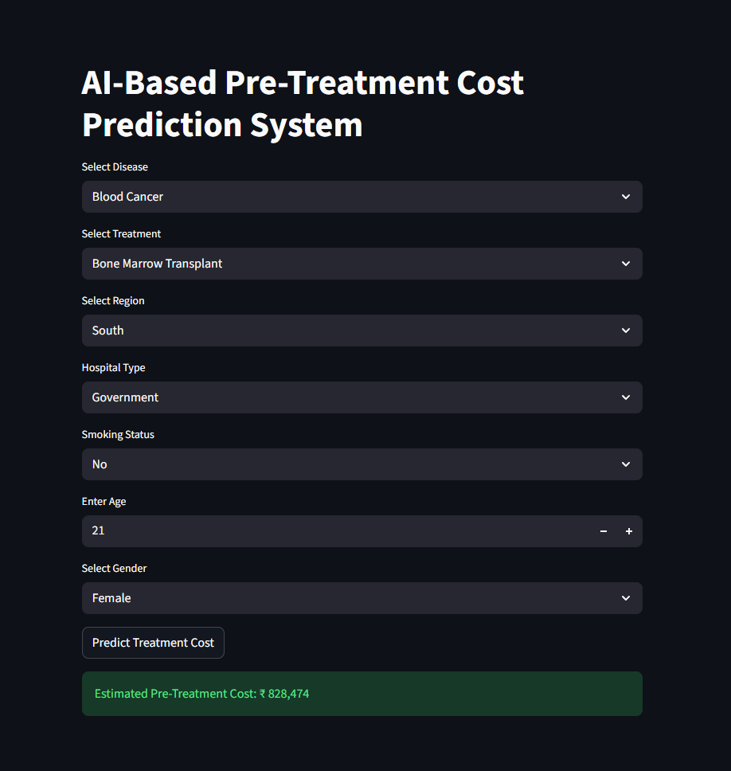

# 🏥 AI-Based Pre-Treatment Medical Cost Prediction System

## 📌 Project Overview

The **AI-Based Pre-Treatment Medical Cost Prediction System** is a Machine Learning application that predicts the estimated cost of medical treatment based on patient and treatment-related information.

The system uses a **Random Forest Regression** model and provides an interactive **Streamlit web application** where users can enter patient details and receive an estimated pre-treatment cost.

---

## 🎯 Problem Statement

Medical treatment costs can vary significantly depending on factors such as:

* Disease
* Treatment type
* Patient age
* Smoking status
* Gender
* Region
* Hospital type

This project aims to provide an **estimated treatment cost before treatment begins** by analyzing these factors using a Machine Learning regression model.

> ⚠️ **Disclaimer:** The prediction is an estimate generated from the project's dataset and should not be considered an actual medical or financial quotation.

---

## ✨ Features

* Predicts estimated pre-treatment medical costs
* Interactive Streamlit web interface
* Disease-based treatment selection
* Handles categorical variables using One-Hot Encoding
* Converts smoking status into numerical values
* Random Forest Regression model
* Model evaluation using R² Score and Mean Absolute Error
* Trained model saved using Python Pickle
* Git LFS used for the large trained model file

---

## 🤖 Machine Learning Model

### Random Forest Regressor

The project uses a **Random Forest Regression** algorithm to predict the estimated medical treatment cost.

### Model Configuration

| Parameter            | Value |
| -------------------- | ----: |
| Number of Estimators |   300 |
| Maximum Depth        |    15 |
| Random State         |    42 |
| Test Size            |   20% |

---

## 🔄 Data Preprocessing

The following preprocessing steps are performed before training the model.

### 1. Smoking Status Encoding

Smoking status is converted into numerical values:

* **Yes → 1**
* **No → 0**

### 2. One-Hot Encoding

One-hot encoding is applied to the following categorical features:

* Disease
* Treatment
* Region
* Hospital Type
* Gender

### 3. Train-Test Split

The dataset is divided into:

* **80% Training Data**
* **20% Testing Data**

---

## 📊 Model Performance

The model was evaluated on **800 test samples**.

| Metric                  |    Result |
| ----------------------- | --------: |
| Training Samples        |     3,200 |
| Testing Samples         |       800 |
| Features After Encoding |        29 |
| R² Score                |   0.99684 |
| Mean Absolute Error     | ₹9,778.91 |

The **R² score of 0.99684** indicates that the model explains approximately **99.68% of the variance** in the target values on this particular test split.

The **Mean Absolute Error (MAE) of approximately ₹9,779** represents the average absolute difference between predicted and actual costs on the test set.

> ⚠️ **Important:** These results are based on this project's dataset and test split. They should not be interpreted as real-world medical cost accuracy.

---

## 🖥️ Streamlit Application

The project includes an interactive Streamlit web application.

Users can provide the following information:

* Disease
* Treatment
* Region
* Hospital Type
* Smoking Status
* Age
* Gender

After clicking **Predict Treatment Cost**, the trained Random Forest model generates an estimated pre-treatment cost.

### 📸 Application Screenshot



---

## 💰 Example Prediction

The application generates an estimated pre-treatment cost based on the selected patient and treatment information.

**Example Output:**

> **Estimated Pre-Treatment Cost: ₹394,704**

---

## 🛠️ Technologies Used

| Technology       | Purpose                             |
| ---------------- | ----------------------------------- |
| **Python**       | Programming language                |
| **Pandas**       | Data manipulation and preprocessing |
| **NumPy**        | Numerical operations                |
| **Scikit-learn** | Machine Learning model development  |
| **Streamlit**    | Interactive web application         |
| **Pickle**       | Saving the trained model            |
| **Git**          | Version control                     |
| **Git LFS**      | Large model file management         |

---

## 📂 Project Structure

```text
ai-medical-cost-prediction/
│
├── app.py
├── train_model.py
├── dataset.csv
├── model.pkl
├── app_screenshot.png
├── requirements.txt
└── README.md
```

> **Note:** The exact filenames may vary depending on the files present in the repository.

---

## ▶️ How to Run the Project

### 1. Clone the Repository

```bash
git clone https://github.com/avalapraveena10/ai-medical-cost-prediction.git
```

### 2. Navigate to the Project Directory

```bash
cd ai-medical-cost-prediction
```

### 3. Create a Virtual Environment

```bash
python -m venv venv
```

### 4. Activate the Virtual Environment

For Windows:

```bash
venv\Scripts\activate
```

### 5. Install Required Dependencies

```bash
pip install -r requirements.txt
```

### 6. Run the Streamlit Application

```bash
streamlit run app.py
```

The application will be available at:

```text
http://localhost:8501
```

---

## 🔁 Application Workflow

```text
User Input
    ↓
Data Preprocessing
    ↓
Feature Encoding
    ↓
Trained Random Forest Model
    ↓
Cost Prediction
    ↓
Estimated Pre-Treatment Cost
```

---

## 🚀 Future Enhancements

* Deploy the application to a cloud platform
* Add a larger and more diverse medical cost dataset
* Add additional patient and hospital-related features
* Compare multiple regression algorithms
* Add interactive data visualizations
* Improve model generalization
* Add prediction uncertainty or confidence information
* Implement model monitoring
* Provide historical cost analysis and trends

---

## ⚠️ Disclaimer

This project is developed for **educational and demonstration purposes**.

The predicted medical cost is generated by a Machine Learning model trained on the project's dataset. It should **not be used as a substitute for an official hospital quotation, medical advice, insurance estimate, or financial decision**.

---

## 👩‍💻 Author

**Avala Praveena**

Computer Science Engineering Student

GitHub: **avalapraveena10**
